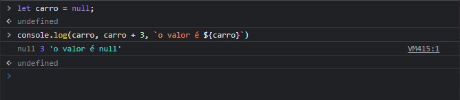

# Undefine
### Representa um valor não-setado
 
### quando nos, usamos uma variável undefined com uma expressão numérica o resultado e NaN
# Null
### Seta, explicitamente uma variável sem valor

### quando colocamos null em expressão numérica, ele automaticamente e interpretado como zero
