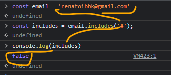
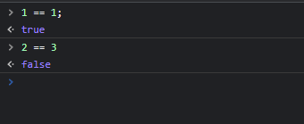
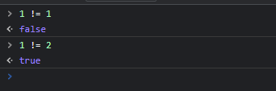
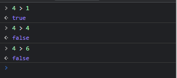
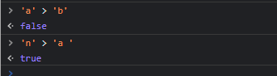
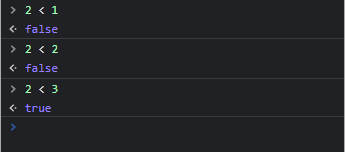

# boolean

### Booleano é um tipo de dado lógico que pode ter apenas um de dois valores possiveis: verdadeiro = true , ou falso = false.
#### Quando utilizar o boolean. quando presizar verificar uma condição no codígo
# métodos podem retornar booleans
## includes()
### O método includes() determina se um array/string contém um determinado elemento, retornando true ou false 

### O método includes() retornor true porque achou o valor @ na string email

# O método includes() retonor false porque não achou o valor # na string email
# operadores de comparação
* == (igualdade)
* !=  (desigualdade)
* '>   (maior que)'
* '>= (maior ou igual)'
* <   (menor)
* <= (menor ou igual)
# operador de igualdade: ==
### este operador é usado para saber se dois valores são iguais. Se for, o javascript responde com true e se não forem, com false.

# Operador de diferente !=
### O operador de diferente é o != e ele retorna true quando dois valores valores comparados são diferentes e retorna false quando eles são diferentes!

### != É O CONTRÁRIO DE ==
# Operador maior que: >
### O > é simbolo de 'maior que'.
### quando fazemos 4 > 1 o js retorna verdadeiro
### se for igual ou menor, retorna false

com strings

# operador maior ou igual: >=
### esse operador só retorna falso se for menor 

# Operador menor: <
### Retorna verdadeiro sir for menor comparado ao ouro valor 

# Operador menor ou igual <=
 ### no operador  igual ou menor o javascript só retorna falso  caso o primeiro valor for maior que o segundo 
 