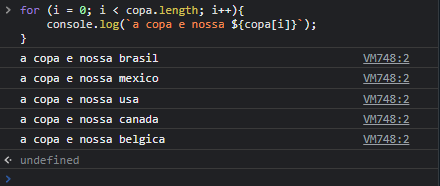

# for loop
###  o que é um loop? É um código que vai ser repetindo até que uma determinada condição seja alcançada, ou até mesmo que não haja condição de parada, estes são conhecidos como loops infinitos.
### o loop FOR é utilizado quando conhecemos a quantidade de repetições do loop 
## sintaxe 
## for (inicialização; condição; incremento) {
    // código que será repetido
}

# length

### usei o tamanho do array como condição de parada 