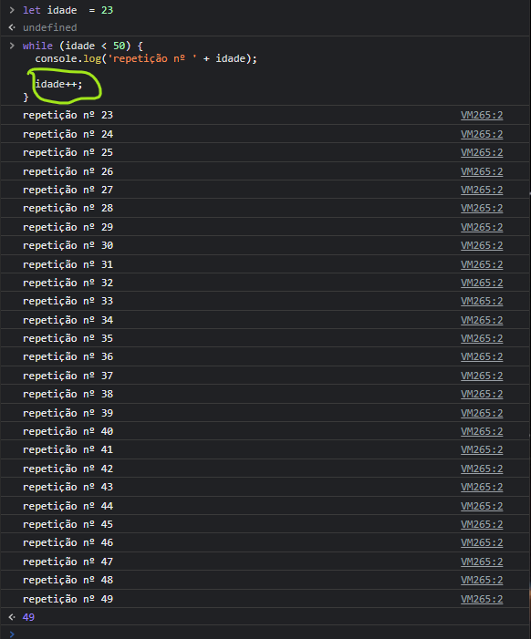
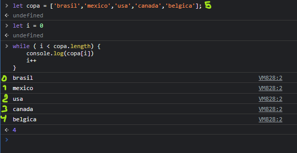

# while loop
### No while um bloco de código é executado ate que um teste condicional se torne falso, sendo importante lembrar que a condição analisada para a execução do laço de repetição deverá retornar um valor booleano. caso não retorne false vira um loop infinito

# loop infinito

##  o bloco de código dentro do while foi executado até que a condição i < 5 formando o loop infinito 
## sintaxe
while (contador < 50) {
  console.log('repetição nº ' + contador);

  contador++;
}

### para evitar o loop infinito a um incremento no bloco de código 

## while com arryas 
