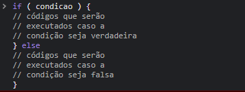

# condicional IF ou else
## if
### A condicional if é uma estrutura condicional que executa a afirmação, dentro do bloco, se determinada condição for verdadeira. Se for falsa, executa as afirmações dentro de else.

## exenplo prático

## else 
### Existem casos em que precisamos executar um código caso uma condição seja verdadeira ou um outro, caso ela seja falsa. Para isso utilizamos a palavra-chave else.

### exemplo prático

## else if
###  utilizar if e else permite ao JavaScript executar um código dentre duas opções. Porém, há casos em que devemos testar uma nova condição antes de executar o trecho de código alternativo. Uma forma de escrever essa verificação é utilizando else if.
