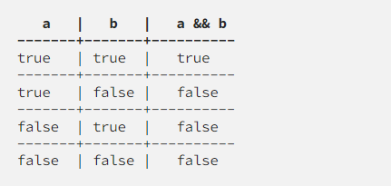

# operadores lógicos
## ! || &&
# ! operador lógico NÃO(Logical NOT)
### JavaScript utiliza o ponto de exclamação ! para representar o operador lógico NÃO.
### Quando você aplica o operador de negação ! a um valor booleano, o ! retorna true se o valor for false e retorna false se o valor for true, ou seja, vai retornar o valor contrário.

# || OPERADOR LÓGICO OU
### O JS usa o pipe duplo || para representar o operador lógico OU (logical OR operator). Você pode aplicar o operador || para dois valores de qualquer tipo:

### se as dus condições forem false o codigo if não e executado

# && Operador Lógico E
### O JavaScript usa dois "e comerciais" && para representar o operador lógico E (Logical AND operator).
### tabela de resutado do operdor && quando apicado a dois valores booleanos.

## exemplo prático
## 1°

## 2°

## 3°

