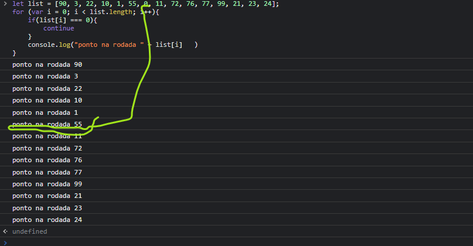
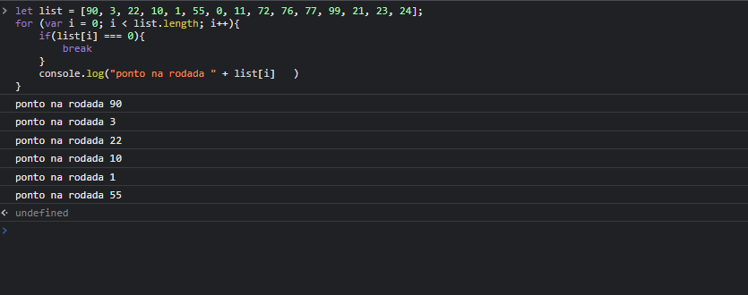

# break e continue
# continue
### A palavra-chave continue termina a atual, e contínua a execução deste laço com a próxima iteração.

# break
### O comando break serve para encerrar a leitura. o break é um comando que podemos utilizar quando queremos parar, encerrar o laço de repetição na hora
