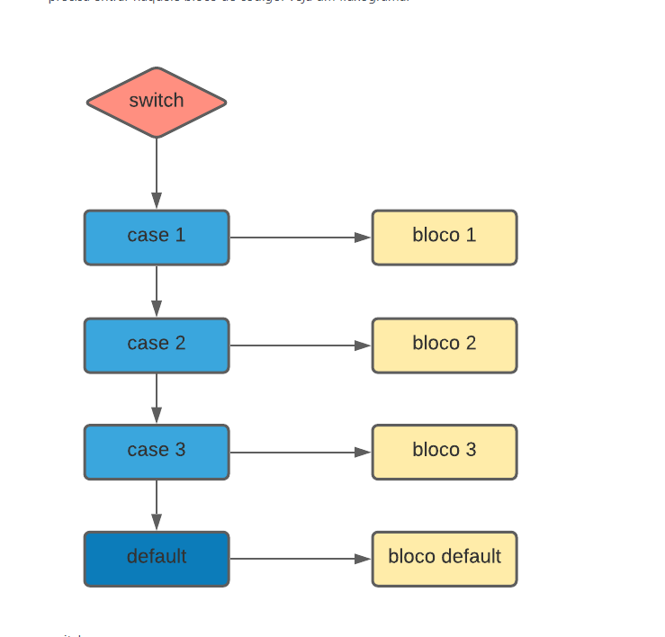
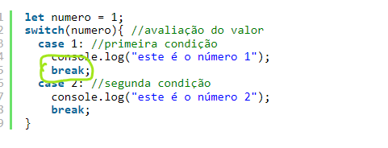
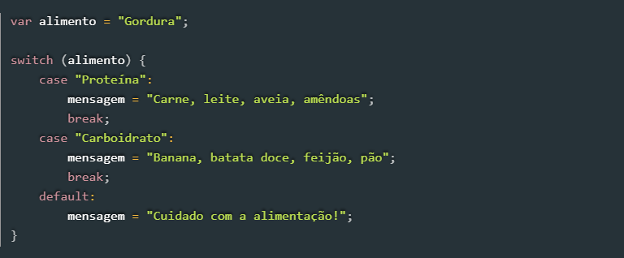

# Switch
### A estrutura condicional switch permite executar um bloco de código diferente de acordo com cada opção (cada case) especificada. Seu uso é indicado quando os valores a serem analisados nessas condições são pré-definidos.
## Sintaxe
### basicamente terá primeiro a avaliação de condição, caso o valor seja igual ao valor passado para o case, significa que atendeu a condição e precisa entre naquele bloco de código

## exemplo com uso 

### o resultado que sera exibido 1° case.  Executando o código dentro do case 1 e quando encontra o break
