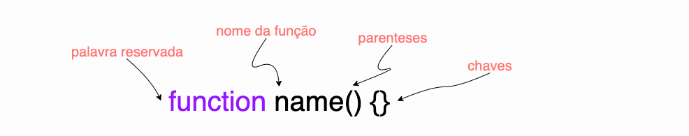

# função
 segundo a documentação javascript
 ### Funções são blocos de construção fundamentais em JavaScript. Uma função é um procedimento de JavaScript - um conjunto de instruções que executa uma tarefa ou calcula um valor. Para usar uma função, você deve defini-la em algum lugar no escopo do qual você quiser chamá-la.
 ## Declarando uma função
 
* palavra reservada function
* noma da função
* lista de argumentos para função, entre parênteses e separados por vírgula
* declaração do javascript que definem a função, entre chaves { }
