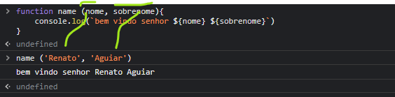
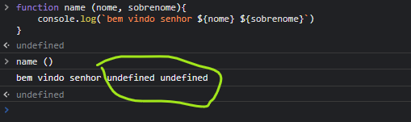
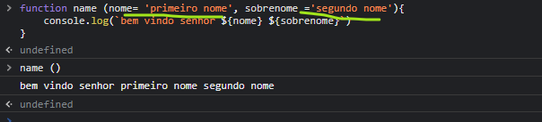

# Argumentos, parâmetros e default parâmetros

### parâmetros nome e sobrenome
### argumentos Renato e Aguiar a ordem dos argumentos deve  corresponder a ordem dos parâmetros

### como evitar o undefined

### repare nos parâmetros colocamos valores que podem ser sobrescrito com argumentos 