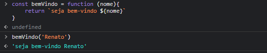

# arrow function
### arrow function são uma forma mais curta, mais bem poderosa 
## Sintaxe básica
# funcão comvesional
### código

# função arrow
### código

### não escrevemos function e tambem, usamos o sinal => 
# Recursos das Arrow Functions
## return: se nossa função arrow possuir apenas um comando return, não precisa informa,mas apenas o valor que queremos retornar
## exemplo 1

## exemplo 2 

## paramentros
### note que o parênteses. isso porque ele e um parâmetro único na função. se a função possuisse mais de um parâmetro, serìamos obrigados a colocar os paênteses
## exemplo pratico

