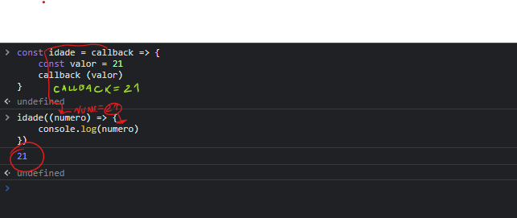
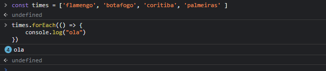
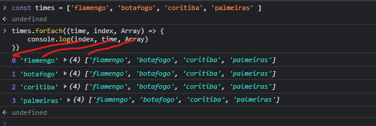

# forEach e callbacks
## o que é uma função de callback ?
### em javascript funções são objetos, podemos passar objetos para funções como parâmetros!
### então podemos passar funções como parâmetros para outras funções e chamá-las dentro das funções externas
## exemplo 

# forEach
### O método forEach() executa uma dada função em cada elemento de um array.
### for Eachpercorre todos os itens de um array igual o loop for normal, isso é porque internamente ele possui um loop for

### A frase 'olá' foi exibida 4x, 1x para cada item no array
## parâmetro do forEach
* ###  o primeiro parâmetro e o item atual que esta sendo iterado
* ### índice é a posição do array que está sendo lida. Parâmetro opcional da função.
* ### array é o array a ser percorrido no forEach().Parâmetro opcional da função.
# exemplo
