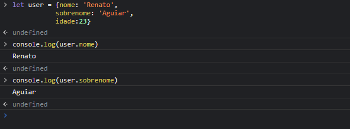

# Criando um objeto literal

### um objeto literal é composto por um par de chaves {}, que envolve uma ou mais propriedades. Cada propriedade segue o formato "nome: valor" e separados por vírgula
# acessando propriedades e métodos 
### Após ter criado um objeto, podemos  acessar os valores guardados em um objeto de duas maneiras.
### utilizando notação de ponto ou notação de colchetes.

# modificando e adicionando propriedade
## modificando 
### para altera uma propriedade do objeto basta acessar a propriedade que deseja altera, utilizando a natação de ponto e atribuir o novo valor 
### exemplo

## adicionando
### da mesma forma que utilizamos a sintaxe para alterar vamos adicionar 
## exemplo 

