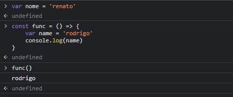

Variáveis e escopo de bloco
# o que é escopo ?
### e a área em que o valor de uma variável esta disponível 
# javascript tem três tipos de escopos: Escopo Global, Escopo da Função e escopo do bloco (ES6).
## Escopo global - quando criamos variáveis ou funções na raiz do documento, significa que ela vai ter um escopo global, ela pode ser acessada ou usada em qualquer lugar do arquivo JS

## Escopo da Função - variáveis, funções e parâmetros de declarados em uma função são acessíveis dentro da função, mas não fora dela

## escopo de bloco - anteriormente falamos de escopo criado por funções, mais não e a única forma de criar escopo no JS. qualquer estrutura que utiliza chaves como if, for, while e outros

## const e let - Essas Keywords permitem que trabalhemos não só com escopo de funções, mas também com o escopo dos blocos, 
## exemplo- se utiliza o var 

## veja que temos duas variáveis com o mesmo nome. Uma delas está no escopo global, e outra dentro do escopo de função.
## isso pode causar uma série de problemas em um código complexo, podemos ter trocas de variáveis indesejadas
## para isso não ocorrer, usamos let e const, ambos possuem escopo de bloco
