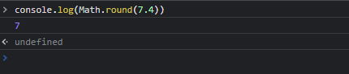
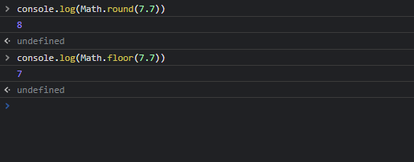
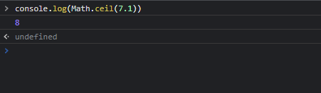
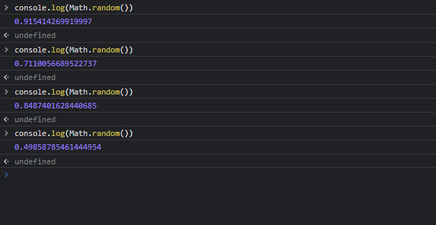

# objeto math
### este objeto é utilizado para realizar operações matemáticas, sejam elas aritméticas, funções trigonométricas, funções de arredondamento e comparações. A sintaxe de utilização dos métodos deste objeto é a seguinte:

## Math.método(valor)
# propriedades do objeto math
* E: Constate de Euler e a base 
 dos logaritmos naturais (próximo de 2,118)
* LN2: Logaritmo natural de 2.
* LN10: Logaritmo natural de 10.
* LOG2E: Logaritmo na base 2 de E.
* LOG10E: Logaritmo na base 10 de E.
*PI: Equivalente numérico de PI, arredondado para 3,14.
* SQRTI_2: Raiz quadrada de um meio.
* SQRT2: Raiz quadrada de 2.
# métodos do objeto math
## Math.round(x)

Retorna o valor arredondado de x, para o valor inteiro mais próximo.

# método Math.floor

FLOOR: Este método retorna o maior inteiro menor ou igual a um número.

#  Método Math.ceil
esse método sempre vai arrendondar o número para sima independente do número decimal dele

# método math.trunc
esse método remove qualquer dígito fracionários

# método Math.random
esse método retorna um número aleatório entre 0 e 1

# entre 0 e 100

usando o método round para arredondar os números e multiplicar por 100 = surgi um número aleatório
entre o e 100