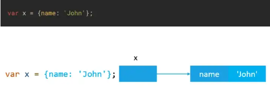
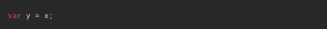
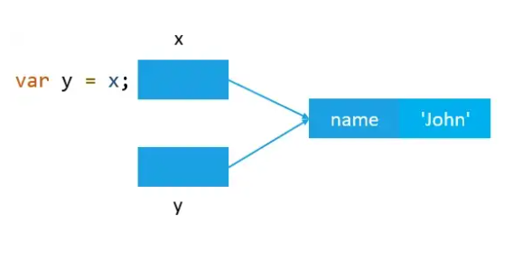
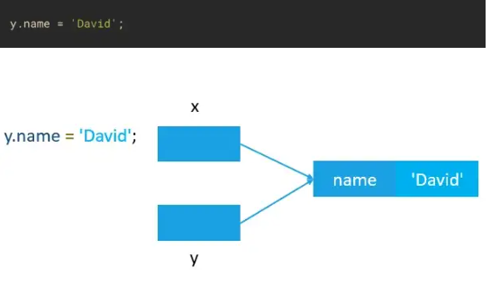
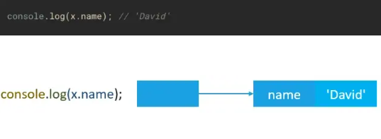

# Tipos de referência e tipos primitivos
## todos os tipos de objetos
* objetos literais
* arrays
* funçôes
* dats
* todos os outros objetos
# tipos primitivos
* numbers
* strings
* booleans
* null
* undefined
* symbol
* bigint
## a diferença entre os valores primitivos e de referência no javascript e a forma que eles são armazenados
## valores primitivos são armazenados na stack, que e uma pilha de diferentes valores na memória
## valores de referência são armazenadas na heap, é uma grande área da memória onde armazena, de forma não ordenada 
### essas diferencias implica no resultado quando copiamos valores primitivos e valores de referência

## Copiando valores primitivos
### Quando você atribuir uma variável que armazena um valor primitivo a outra variável, o valor armazenado é criado e copiado na nova variável.

# Vamos ver um exemplo:

## Primeiro, declaramos uma variável "a" e a inicializamos seu valor com o número 10.

## declaramos outra variável b e atribuímos a ela o valor da variável a

## internamente, o motor do javascript copia o valor armazenado em 'a' para 'b'

## como a e b não se relacionam, atribuímos á variável b um novo valor 20. Quando alteramos o valor de b o valor da variável a não muda.

# copiando valores de referência
## Quando você atribui um valor de referência de uma variável para outra, o valor armazenado na variável também é copiado no local da nova variável.
## A diferença é que os valores armazenados nas duas variáveis agora são o endereço do objeto real armazenado no heap. Como resultado, ambas as variáveis estão referenciando o mesmo objeto.
# exemplo
## declaramos uma variável 'x' que contém um objeto cuja propriedade e 'name: 'john'

## declaramos outra variável y atribuímos o valor de x para essa nova variável y.

## agora x e y estão fazendo referência ao mesmo objeto no heap

## modificamos o valor armazenado na propriedade name do objeto usando a variável y alterando o nome para 'David' 

## como ambas variáveis x e y fazem referência ao mesmo objeto, a alteração também será refletida na variável x
