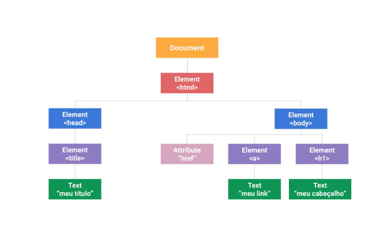

# DOM - Document Object Model
### DOM - Ele representa os objetos de uma página HTML em forma de uma árvore. O DOM é importante pois é através dele que acessamos os elementos dentro de uma página HTML. Em outra palavras, obtemos acesso ao documento HTML através do DOM.
# árvore DOM

### Assim, enquanto o DOM representa e estrutura e os componentes da página, o JavaScript acessa e manipula esses conteúdos. 
# Tipos de Dados Fundamentais
## toda página da web pode ser representada em estrutura de árvore. O topo dessa árvore é estruturado pelo modelo de documento por objetos e terá o documento e elemento raiz HTML.

## A partir dele, se ramificam os “elementos-filhos”, como Head e Body. Estes, por sua vez, também podem ter elementos-filhos, e todos os elementos podem possuir atributos.

* Document: é o objeto raiz, representa o próprio documento HTML. 
* Node: é um nó, e representa uma nomenclatura mesmo: todo objeto em um documento é algum tipo de nó.
* Element: o nó do tipo elemento representa as tags do documento HTML, isto é, o objeto de elemento pode ter “nós-filhos”, como de texto e de atributos.  
* Attribute: este tipo de objeto representa um atributo contido num elemento HTML.
* Text: é o texto, ele fica * * * localizado entre os elementos e representa o conteúdo das tags, ou elementos. Por exemplo: a tag P que usamos nos parágrafo

## Todos estes dados da árvore DOM podem ser adicionados, removidos ou alterados pelo JavaScript. O DOM conta com diversos métodos que podem ser utilizados para fazer a ligação entre esses objetos.