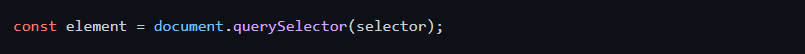
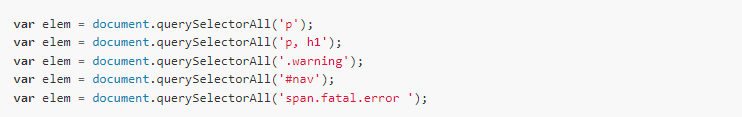

# Document.querySelector() e quarySelectorALL
# Document.querySelector()
### Quando se trata de querySelector(), esse método permite que os usuários descubram um elemento que corresponda a um ou mais seletores CSS. Observe que você pode utilizar esse método em qualquer documento ou elemento HTML. Em termos de sintaxe, esse método é expresso em uma forma de declaração:

## querySelectorAll()
### este é o método definitivo de seleção de elemento: trata-se de uma técnica muito poderosa por meio da qual os programas JavaScript do lado do cliente podem selecionar os elementos do documento que vão manipular.
### A funcao querySelectorAll() permite que os seletores CSS sejam usados no JavaScript,

## A funcao querySelectorAll() recebe um argumento de string contendo um seletor CSS e retorna um objeto NodeList representando os elementos do documento que correspondem ao seletor. Se nenhum elemento coincide, a função retorna um objeto NodeList vazio. Se a string do seletor é inválida, querySelectorAll() lançará uma exceção.