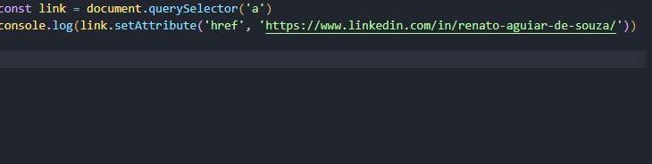
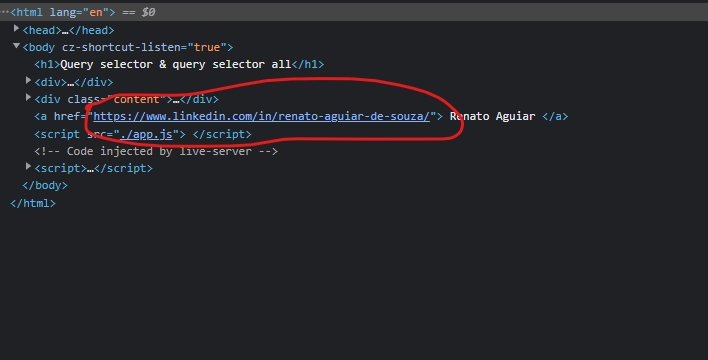
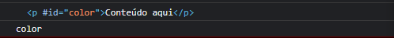

# Obtendo e setando atributos
## setAttribute()
### esse método é bem simples de utilizar, basta informar dois parâmetros de entrada, o primeiro referente ao nome do atributo HTML que deseja adicionar à tag e o segundo referente ao valor do atributo

## aplicação do método

## resultado

## getAttribute()
### getAttribute() retorna o valor de um argumento específico do elemeto Se o atributo não existir, o valor retornado será null ou ""
# exemplo

