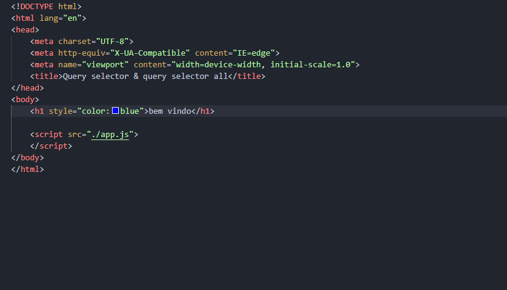

# modificando css
## propriedade style
### podemos usar essa propriedade para obter adicionar ou remover estilos de um elemento html
## EXEMPLO
## HTML

## PÁGINA NO NAVEGADOR

## MUDANDO A COR DA FONTE USADO A PROPRIEDADE STYLE

## PÁGINA NO NAVEGADOR

# para ver todos os métodos que posso usar no elemento 
