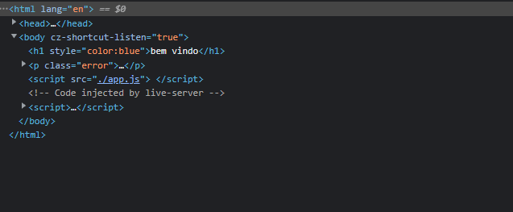
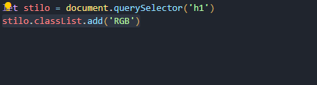
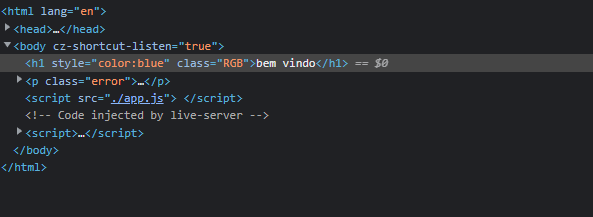
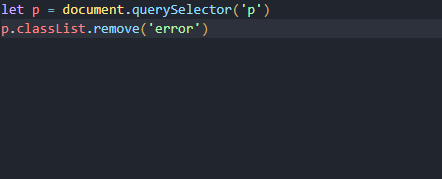
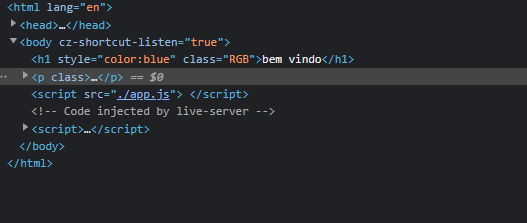
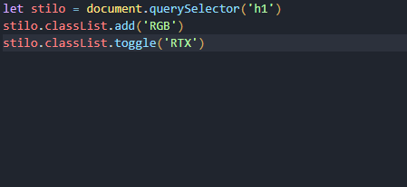
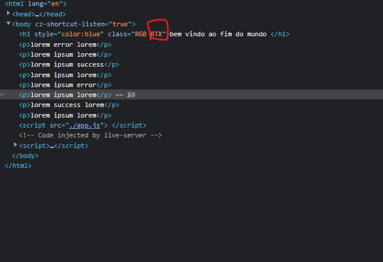

# INTERAGINDO COM CLASSES CSS
## O método classList é um método do DOM (Document Object Model) que permite manipular as classes de um elemento HTML. Ele retorna um objeto do tipo DOMTokenList que possui vários métodos para adicionar, remover e verificar a existência de classes em um elemento.
## Por exemplo, considerando o seguinte fragmento de HTML:

## Você pode usar o classList para adicionar uma classe ao elemento H1 usando o seguinte código JavaScript:

## Isso fará com que o elemento H1 tenha a classe 'RGB'

## posso tambem remover uma classe específica usando o classList.remove()
## exemplo de como usar o classList.remove()

## vou remover a cass erro da tag 'p'

## resultado na estrutura html

## Para alternar uma classe em um elemento HTML com JavaScript, você pode usar o método classList.toggle(). Esse método irá adicionar a classe ao elemento se ela não estiver presente, ou removê-la se já estiver.

## exemplo de como usar o classList.toggle():
## html

## exemplo de como usar o classList.toggle():

## resultado
