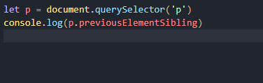

# Pais, filhos e irmãos
## No HTML, a propriedade parentElement se refere ao nó pai de um elemento no DOM 
### parentElement se refere ao nó diretamente acima dele na árvore.
## exemplo
### estrutura html 

### escript js

## Neste exemplo, o elemento h2 é o elemento filho do elemento article.

## A propriedade nextElementSibling é um método que permite acessar o elemento irmão imediatamente seguinte de um elemento específico em uma página HTML
# exemplo
### estrutura html 

### escript js

## Neste exemplo, o elemento h2 é o elemento irmão do elemento p.

## A propriedade previousElementSibling é muito similar à propriedade nextElementSibling. Ela também pertence ao objeto DOM e permite acessar o elemento irmão anterior de um elemento específico em uma página HTML.
## exemplo 
### estrutura html 

### escript js

## Neste exemplo, o elemento h2 é o elemento irmão anterior do elemento p.

