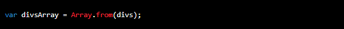

# O que é array from?
## Array from é um método nativo do JavaScript, capaz de criar uma instância de um Array a partir de diferentes tipos de dados. Ou seja, caso tenhamos um array-like (objeto semelhante a um Array) ou um objeto iterável, podemos utilizar esse método para convertê-los e acessar todas as propriedades, assim como as vantagens, de um Array.
# Por exemplo, imagine que você tem o seguinte código:

## Para transformar esse objeto em um array de verdade, você pode usar o método Array.from

### Agora o objeto divsArray é um array de verdade e você pode usar todos os métodos de array nele.