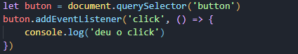
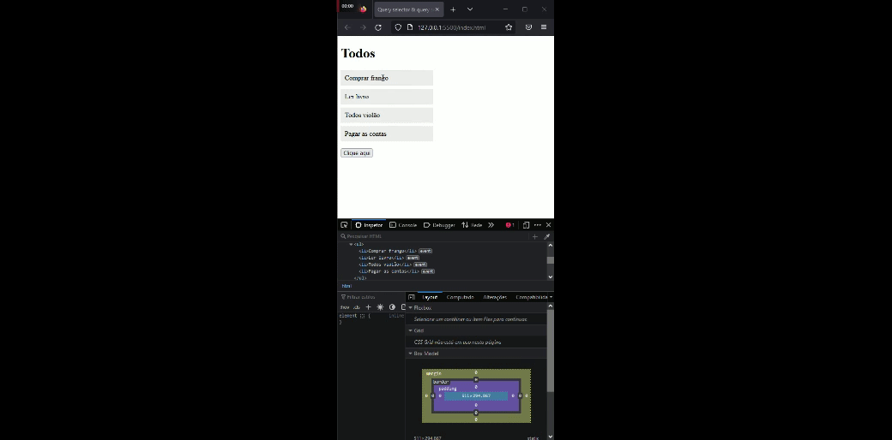
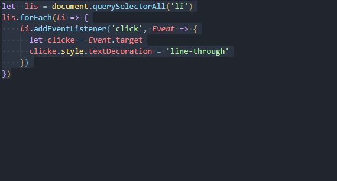

### EventListener é uma interface do JavaScript que representa um objeto que pode escutar eventos e executar uma ação quando um evento específico ocorre. É comumente usado para adicionar comportamento a elementos HTML ou para reagir a eventos em outros objetos em uma aplicação.
# eventos de click
### Para adicionar um evento de clique a um elemento HTML usando JavaScript,  o método addEventListener() do elemento. Ele recebe dois parâmetros: o nome do evento ('click', neste caso) e uma função de callback que será executada quando o evento ocorrer. Por exemplo:
# estrutura html

# escript

# resultado

## adicionado eventos 

### Esse código usa o método querySelectorAll() para selecionar todos os elementos 'li' da página. Em seguida, ele usa o método forEach() para iterar sobre cada um desses elementos e adicionar um evento de clique a cada um deles. Quando o evento de clique ocorre, uma função de callback é executada.

### A função de callback recebe um parâmetro chamado "Event", sendo um objeto que representa o evento de clique. Esse objeto tem uma propriedade chamada "target" que contém o elemento que foi clicado. No código, essa propriedade é armazenada em uma variável chamada "clicke".

### Após armazenar o elemento clicado em uma variável, o código usa o método style.textDecoration para adicionar uma linha de riscado ao elemento. Isso é feito alterando a propriedade textDecoration para 'line-through'.

### Esse código faz com que todos os elementos 'li' da página fiquem riscados quando são clicados.
