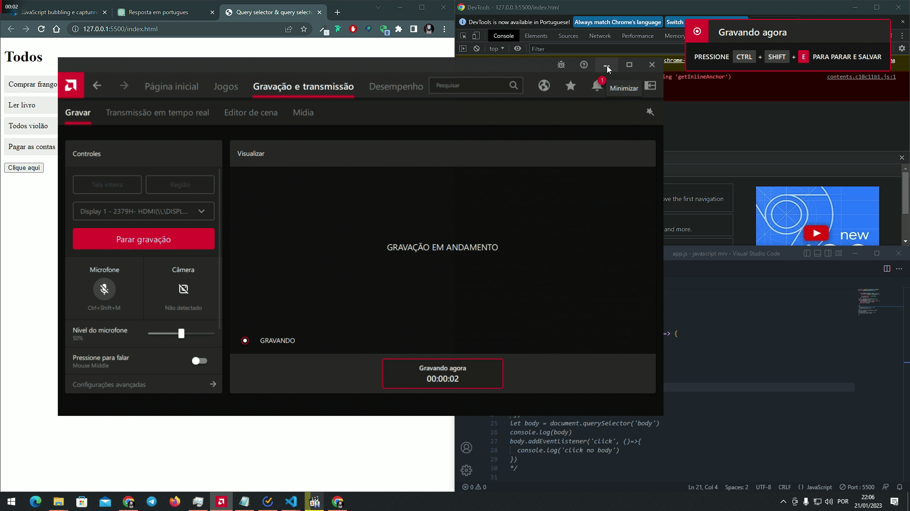

# Evento bubbling 
### O efeito bubbling e quando acontece um evento e acionado em um elemto filho, ele é propagado para seus elementos pais. Por exemplo, a tag ul dentro da ul tem as li. 
### Se no li tiver um evento atrelado a ela. Esse evento vai ser disparado e esse evento vai ser propagado para o pai que e a ul. Se a ul tiver um evento atrelado a ela também vai ser disparado 
# Exemplo prático
### O efeito bubble vai de baixo para cima do target que ele foi acionado até o fim da árvore DOM

## COMO EVITAR A PROPAGAÇÃO 
### simples, colocando o método 'stopPropagation()' no elemento 