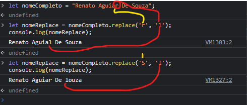

# métodos comuns de strings

## lastIndexOf()

### O método lastIndexOf(), ele vai obter o index da última ocorrência do valor especificado encontrado na String
## slice()
.png)
### O método slice() seleciôna uma parte da strig, mas não altera 
## replace()

### O método replase() pode substituir uma string por outra. Sem alterar a string original 