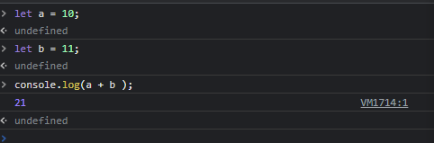
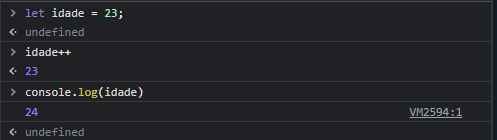
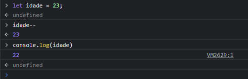
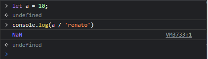

# numbers

## inteiros e decimais

### foto acima representa uma variável, uma com número inteiro é outra com número decimal, ambos são número. São mesmo tipo de dado
## operadores aritméticos
### os operadores aritméticos são aqueles que executam operação matemática básicas
## Adição +

## Subtração -

## Multiplicação *

## Divisão /

## Módulo (resto da divisão)

## Incremento ++

##  Decremento --

## Operador de exponenciação **

## Ordem de operadores 
### multiplicação e divisão depois adição e subtração(a soma e sempre realizada da esquerda para direita)
## operadores atribuição
## Atribuição 

## Atribuição de soma

## Atribuição de subtração

## Atribuição de multiplicação

## Atribuição de divisão

## Atribuição de resto

## Nan - not a nameber
### quando nos tentamos fazer uma operação que o javascript não entende 

## contatenação de string com número

### concatenação de strings e numbers, sempre vai ser string