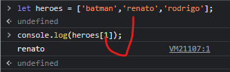
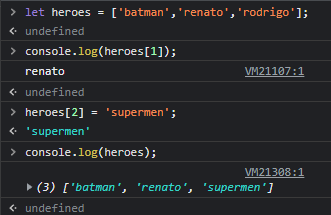
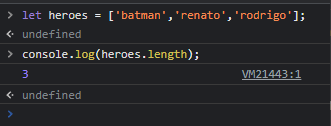
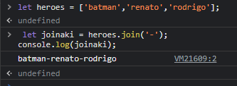
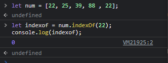
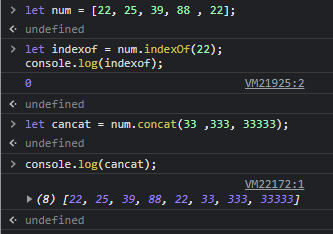
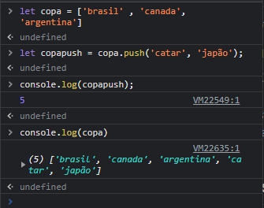
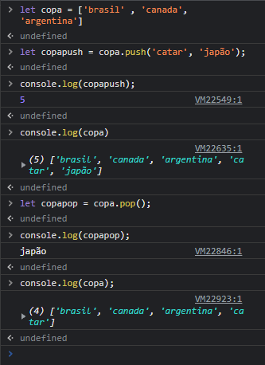

# arrays
### Arrays em JavaScript são usados para armazenar vários valores em uma única variável.

## como selecionar um item
### da mesma forma que utilizamos o length

## como sobrescrever um array

## propriedade3s e métodos de um array
### length

### da mesma forma que a length funcionar com strings ela funcionar com arrays 
## método join()
### esse método vai retorna uma nova string com todos os items do arrays concatenado e separados por vírgula

### join támbem recebe argumentos ('-')

### indexof

o indexOf() ESSE MÉTODO retorna o primeiro índice em que o elemento pode ser encontrado no array
caso não esteja presente o argumento ele retorna -1
### concat()

essa função e ultilizada para concatenar arrays e strings 

não altera o valor da função 
### push()
esse método altera o valor original 

### pop
esse método remove o último item de um array é retorna esse item

