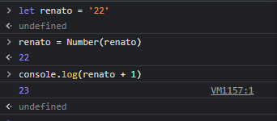
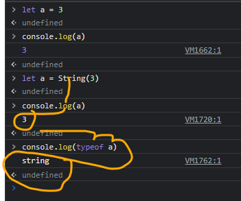
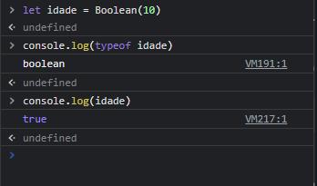

# Conveção de tipos
### a conversão de tipos e uma forma de alterar um tipo de dado para outro, isso e feito  para tirar certos recursos. Um exemplo seria 

### a foto acima mostra uma concatenação de uma string com um número, convertendo o número 1 em uma string 

## number()

### conversão para valores numéricos, number converteu a string 22 para number dando o resultado 23
## typeof

### typeof e a maneira que usamos para verificar um tipo de dado

## string()
### essa função converte valores em string

## booleans

### modificamos o tipo de dado de number para boolean , mais repare que deu true
### porque deu true ?
### no js algums valores são considerados true e outros false 
## valores false
* false
* null
* undefined
* 0
* NaN
* ''
* ´´
* ""
### O RESTO VAI DAR TRUE