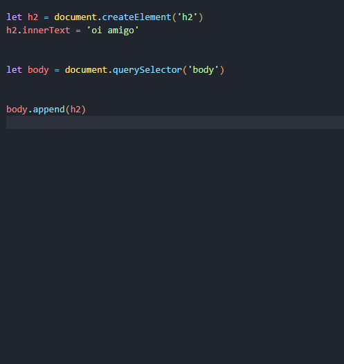
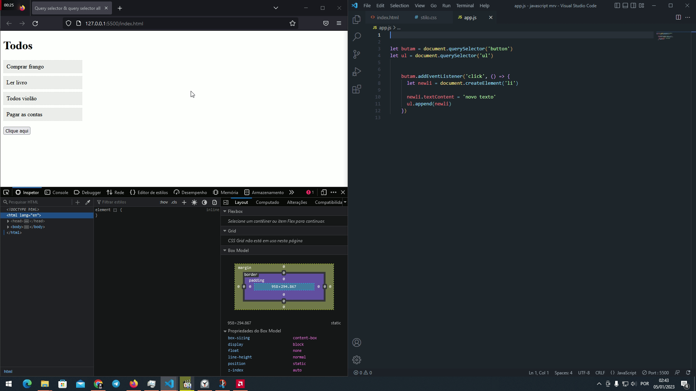

# como remover e adicionar elemento no DOM
### O método remove() que remove o elemento do DOM. Ele remove o elemento do DOM e também remove todos os eventos e atributos associados a esse elemento.
## exemplo do método remove()
### estrutura html

## posso usar o método remove() para remover um elemento depois dele receber um click

# adicionado elementos createElement()

### O método createElement() é uma função do JavaScript que cria um elemento de DOM. Ele é usado para criar elementos HTML dinamicamente.

1° crei uma taga h2
2° inseriie testo usando innerText
3° selecionaei o body
4°  usei append()  para adicionar o novo elemento dentro do body
## método append()
### O método append() é um método de manipulação de DOM usado para adicionar conteúdo ao final de um elemento do DOM. Ele pode ser usado para adicionar elementos HTML, texto ou até mesmo outros elementos do DOM ao final de um elemento.
## posso usar o método createElement() para criar um elemento depois dele receber um click, e colocar dentro de outro elemento html. No exemplo vamos inserir dentro da ul

